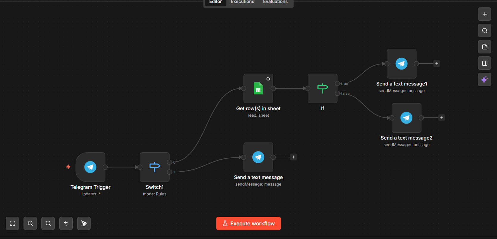
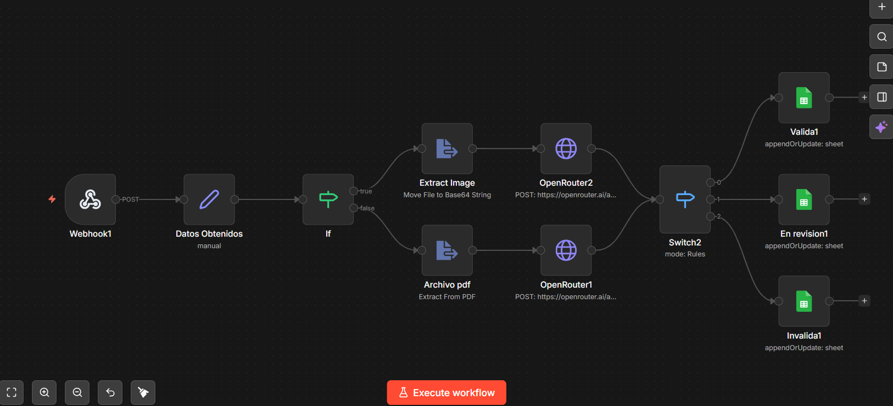

# 📋 Formulario de Justificación de Inasistencias

Este proyecto es un sistema web para que los estudiantes puedan enviar justificaciones de inasistencia con un documento de soporte, y un bot de Telegram para consultar el estado de su solicitud.

---

## 📌 ¿De qué se trata?

Básicamente el sistema hace tres cosas:

1. El estudiante llena un formulario web con sus datos y sube un PDF o imagen como soporte.
2. Un flujo en n8n recibe ese archivo, lo analiza con inteligencia artificial (GPT-4o mini) y decide si la justificación es válida, inválida o necesita revisión.
3. El resultado se guarda en Google Sheets y el estudiante puede consultar el estado de su solicitud desde un bot de Telegram.

---

## 🗂️ Estructura del proyecto

```
proyecto/
├── index.html          # El formulario principal
├── styles.css          # Los estilos del formulario
├── script.js           # La lógica del formulario (validaciones y envío)
├── WorkFlows/
│   ├── Flujo_Formulario.json   # Flujo de n8n que procesa el formulario
│   └── Flujo_Telegram.json     # Flujo de n8n del bot de Telegram
└── .vscode/
    └── settings.json   # Configuración del Live Server
```

---

## 🛠️ Tecnologías usadas

| Tecnología | Para qué se usó |
|---|---|
| HTML, CSS, JavaScript | El formulario web (frontend) |
| n8n | Automatización de los flujos |
| OpenRouter (GPT-4o mini) | Analizar el documento con IA |
| Google Sheets | Base de datos para guardar los resultados |
| Telegram Bot | Para que el estudiante consulte su estado |

---

## ⚙️ ¿Cómo funciona por dentro?

### Flujo del formulario (`Flujo_Formulario.json`)

1. **Webhook** → Recibe los datos del formulario (nombre, ID, correo, motivo y archivo).
2. **Datos Obtenidos** → Extrae y organiza los datos recibidos.
3. **If (imagen o PDF)** → Detecta si el archivo es una imagen o un PDF.
   - Si es **imagen** → La convierte a base64 y se la manda a la IA con visión.
   - Si es **PDF** → Extrae el texto y se lo manda a la IA.
4. **OpenRouter (IA)** → Analiza el documento comparándolo con el formulario y responde con un JSON así:
   ```json
   {"resultado":"VALIDA","confianza":85,"coincidencia":"ALTA","razon":"Documento médico oficial"}
   ```
5. **Switch** → Según el resultado, redirige a una de tres ramas:
   - `VALIDA` → Guarda en Sheets con estado **Aprobada**
   - `REVISION` → Guarda con estado **En revision**
   - `INVALIDA` → Guarda con estado **Invalida**

### Flujo de Telegram (`Flujo_Telegram.json`)

1. El bot recibe un mensaje del estudiante.
2. **Switch** → Detecta si el mensaje es un número de identificación o un saludo.
   - Si es un **saludo** → Responde con un mensaje de bienvenida y pide el número.
   - Si es un **número** → Busca en Google Sheets si existe ese ID.
3. **If** → Si encuentra el ID, responde con el nombre, cédula y estado de la justificación. Si no lo encuentra, avisa que no está registrado.
4. Este es el link del bot deTelegram para que lo pruebes: [t.me/Arturo1302N8nBot]

---

## 🖥️ El formulario web

El formulario tiene tres secciones:

- **Datos personales** → Nombre, número de identificación y correo.
- **Motivo de inasistencia** → Un select con opciones. Si elige "Otro", aparece un campo extra para escribir el motivo.
- **Documento de soporte** → Zona de arrastrar y soltar archivos. Acepta PDF, JPG o PNG de máximo 5 MB.

Las validaciones se hacen en JavaScript antes de enviar, revisando que ningún campo esté vacío, que el correo tenga formato válido y que el archivo sea del tipo y tamaño correcto.

---

## 🚀 ¿Cómo correrlo?

### Requisitos
- Tener **n8n** instalado o una cuenta en n8n Cloud.
- Una cuenta de **OpenRouter** con créditos.
- Un **Google Sheet** con las columnas: `Fecha`, `Nombre Completo`, `ID`, `Correo`, `Motivo`, `Confianza`, `Estado`, `Razon`.
- Un **Bot de Telegram** (creado con BotFather).

### Pasos

1. Clonar o descargar el proyecto.
2. Abrir `index.html` con Live Server (puerto 5501).
3. En n8n, importar los dos archivos `.json` de la carpeta `WorkFlows/`.
4. Configurar las credenciales en n8n:
   - Google Sheets OAuth2
   - Telegram API
5. Cambiar la URL del webhook en `script.js` por la URL real de tu n8n.
6. Activar los flujos en n8n.
7. ¡Listo! Ya puedes probar el formulario.

---

## ⚠️ Cosas a tener en cuenta

- La URL del webhook en `script.js` está en modo **test** (`webhook-test`). Para producción hay que cambiarla por la URL de producción (`webhook`).
- El archivo del formulario en `index.html` tiene un pequeño error de tipeo en la etiqueta `<form>` (está duplicado), hay que corregirlo si se va a usar en producción.
- Las API keys de OpenRouter en los flujos son de ejemplo, hay que reemplazarlas con las propias.

---

## 👤 Autor
Edgar Arturo Ojeda Tarazona

Proyecto realizado como ejercicio de automatización web con IA integrada.

---
## Evidencias Graficas del 

- Flujo en n8n del bot de Telegram



- Flujo en n8n del formulario
